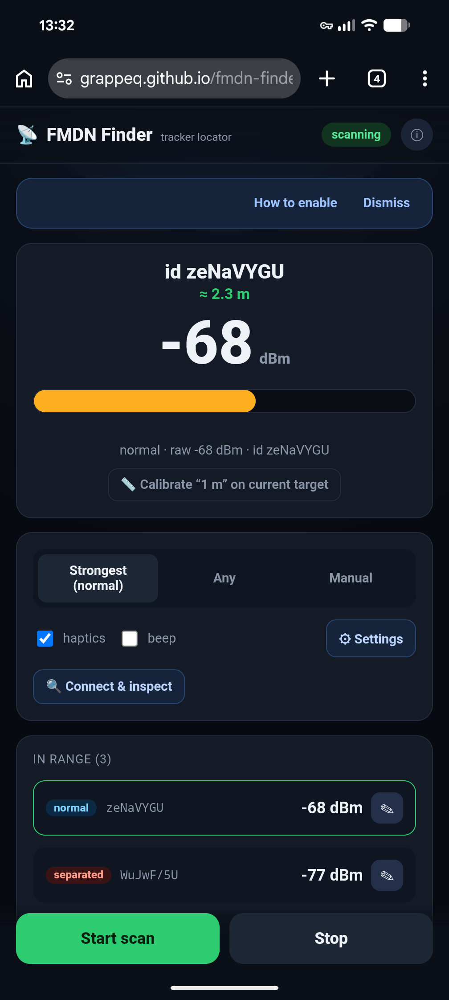

# 📡 FMDN Finder

[](https://github.com/grappeq/fmdn-finder/actions/workflows/test.yml)
[](LICENSE)

**Locate and inspect Google Find My Device (FMDN) Bluetooth trackers — entirely in your browser.**

FMDN Finder turns a phone (or any Chrome device with Bluetooth) into a "hot/cold" signal‑strength
locator for Google **Find My Device / Find Hub** trackers and clones, and a read‑only inspector
that can identify a tag and ring it. It is **100% client‑side**: no servers, no accounts, no
tracking — every advertisement is decoded on your device and nothing ever leaves it.

> 🔗 **Live app:** https://grappeq.github.io/fmdn-finder/
> _(Best on Chrome for Android. See [Requirements](#requirements).)_

<p align="center">
  
</p>

---

## The story behind it

I lost my keys. They had a Bluetooth tracker beacon attached precisely so this would never be a
problem — except the beacon simply **wasn't showing up in the Google Find My Device app**, for
reasons I never fully figured out. So instead of staring at an empty map, I went hunting for stray
beacons around the house: scanning for every Bluetooth tracker advertising nearby, walking around
following the signal getting stronger, and inspecting the ones I found to tell them apart.

It worked — **I found the keys.** This app is that hunt turned into a tool: scan for FMDN trackers,
follow the "hotter/colder" signal to walk one down, and connect to it to confirm which tag it is.
If your own tracker ever goes dark in the official app, you can still find it yourself.

---

## Features

- **Signal hunt** — live RSSI gauge with distance estimate, warmer/colder trend, haptics and an
  optional beep that speed up as you approach the tag.
- **Distance estimate** with one‑tap **"calibrate at 1 m"** for better accuracy.
- **Tag names & history** — label tags (e.g. *"Lost keys"*); names and recently‑seen tags persist
  in `localStorage`. Tap a recent tag to re‑acquire it.
- **Connect & inspect (GATT)** — read Device Information, battery, services, and run the
  unauthenticated **DULT** non‑owner reads (manufacturer / model / firmware). Get a
  **clone vs. certified** verdict.
- **Ring a tag** via DULT `Sound_Start` (works while a tag is in the *separated* state) to find it
  by sound.
- **Installable PWA**, offline‑capable, dark UI, no dependencies.

## Requirements

| Capability | Needs |
|---|---|
| **Signal hunt** (live scanning) | Chrome/Edge **on Android**, the experimental scanning flag, Location ON |
| **Connect & Inspect / Ring** | Chrome/Edge with Web Bluetooth (Android **or** desktop). No flag required |
| **Not supported** | iOS/iPadOS (no Web Bluetooth), Firefox, Safari |

The live **hunt** uses the Web Bluetooth *scanning* API (`requestLEScan`), which is still behind a
flag. Enable it once:

1. `chrome://flags/#enable-experimental-web-platform-features` → **Enabled**
2. If you self‑host over **plain HTTP**, also add the origin to
   `chrome://flags/#unsafely-treat-insecure-origin-as-secure` (the public HTTPS site doesn't need this).
3. **Relaunch Chrome**, and make sure phone **Bluetooth + Location** are ON (Android requires
   Location for BLE scans).

**Connect & Inspect** uses the standard `requestDevice` picker and works without any flag.

## Usage

1. Open the app and tap **Start scan**.
2. The strongest **normal**‑state tag auto‑locks. Walk around — the bar, distance and 🔥/❄️ trend
   rise as you get closer.
3. Stand ~1 m from the tag and tap **Calibrate** to sharpen the distance estimate.
4. Tap **✎** to name a tag. Use **Manual** mode (or a row in *Recently seen*) to lock a specific tag.
5. **🔍 Connect & inspect** → **Connect** to read a tag. First time on a given tag, tap **Pick list**
   once (filtered to FMDN tags) to grant access; afterwards **Connect** is direct.

## How it works

- **Detection** — FMDN trackers broadcast an Eddystone service‑data frame under 16‑bit UUID
  `0xFEAA`. The first byte's high nibble is `0x4`; `0x40` = *normal* (near owner), `0x41` =
  *separated* (anti‑stalking state). See [`js/fmdn.js`](js/fmdn.js).
- **Distance** — a log‑distance path‑loss model, `d = 10^((RSSI@1m − RSSI) / (10·n))`, with `n`
  (environment factor) adjustable in Settings. RSSI is noisy, so distance is an estimate, best for
  relative *hot/cold* guidance.
- **Identification** — over GATT, a Taobao service `0xFEB3` + blank Device‑Info placeholders ⇒
  *clone*; a vendor service `0xFA25` + encrypted (NotAuthorized) Device‑Info ⇒ *certified*. The
  **DULT** non‑owner service (`15190001‑…`) lets anyone read a tag's brand and ring it — the
  anti‑stalking design — though accessory‑info reads only succeed while the tag is *separated*.

## Privacy & security

- **No network requests.** A strict `Content-Security-Policy` (`default-src 'none'`, `connect-src
  'self'`) blocks any external connection. No analytics, no CDNs, no fonts — everything is served
  from the origin.
- **Your data stays local.** Tag names, history and calibration live only in your browser's
  `localStorage`; **Settings → Clear data** wipes them.
- **Web Bluetooth's own model** never exposes a tag's MAC to the page and requires an explicit user
  gesture to connect — by design.

## Limitations

- **Address rotation** — FMDN tags rotate their BLE address (~15 min normally, ~24 h while
  separated), so the browser's opaque per‑device id (and any name bound to it) eventually changes.
- **No MAC access** — Web Bluetooth deliberately hides the hardware address; you can't connect by MAC.
- **Legacy advertising only** — typical scanners miss BLE‑5 *extended‑advertising* tags.
- **Distance is approximate** — RF is noisy; treat it as guidance, not a ruler.

## Development

It's a static site — no build step.

```bash
git clone https://github.com/grappeq/fmdn-finder.git
cd fmdn-finder
python3 -m http.server 8000        # then open http://localhost:8000
```

`http://localhost` is a secure context, so Web Bluetooth works there (still enable the scanning
flag for the hunt). For phone testing against a LAN host over HTTP, use the
`unsafely-treat-insecure-origin-as-secure` flag.

```
index.html             app shell (strict CSP, no inline scripts)
app.css                styles
js/fmdn.js             pure decode / classify / distance / selection helpers (no DOM)
js/app.js              UI controller (scan, render, inspect)
sw.js                  offline service worker
manifest.webmanifest   PWA manifest
assets/                icons
test/fmdn.test.js      unit tests (node:test)
.github/workflows/     CI
```

### Testing

The protocol and logic in `js/fmdn.js` (frame decoding, distance, clone/certified
classification, hunt target selection, history capping) are covered by unit tests using
**Node's built-in test runner — no dependencies**:

```bash
node --test          # requires Node >= 18.17 (20+ recommended)
```

CI runs the suite on Node 20 and 22 for every push and pull request. The UI layer (`js/app.js`)
delegates its logic to these tested pure functions, so regressions surface in CI.

## Contributing

Issues and PRs welcome. Keep it dependency‑free and client‑only; preserve the CSP (no inline
scripts, no external requests).

## Responsible use

The DULT reads and ring action exist to help you find **unknown trackers near you** — that's the
anti‑stalking purpose of the standard. Don't use the ring action to disturb other people's devices.
This software is provided as‑is, with no warranty.

## License

[MIT](LICENSE) © 2026 FMDN Finder contributors
